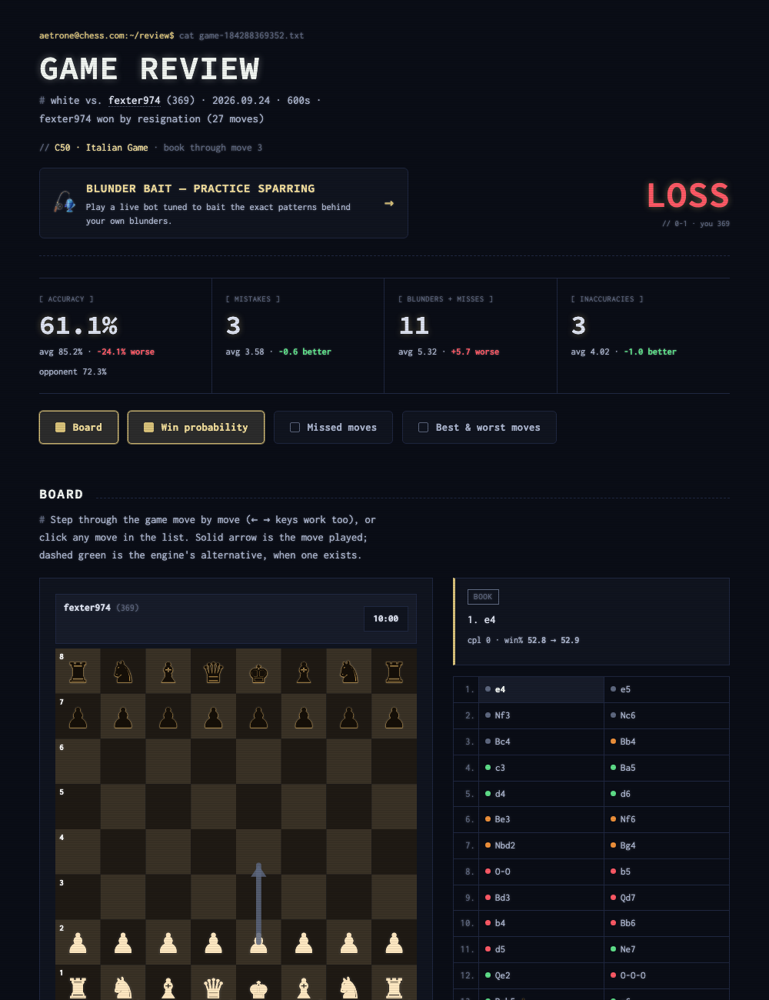
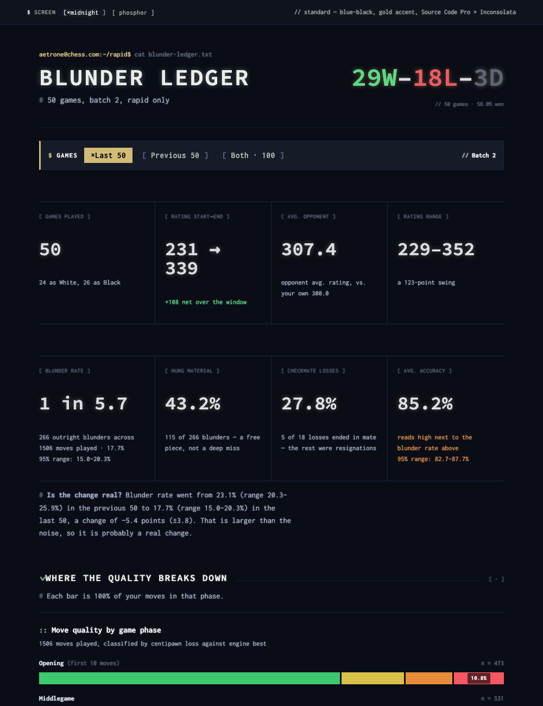
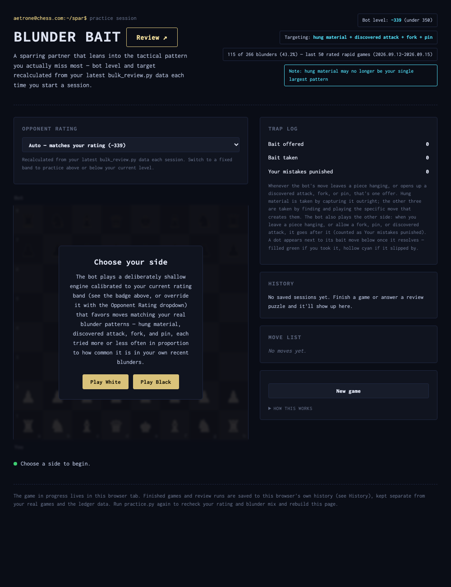

# Blunder Ledger

A set of tools linked to chess.com for a review of any single game, a progress report across a bunch of games, and a practice bot with puzzles built from your own mistakes.

I built this so I could study my own games without paying for chess.com's premium analysis. Everything runs on Stockfish installed on your own computer plus the chess.com public API, so there's no daily limit and nothing to pay for.

You can try it without installing anything. The [demo ledger](https://alfredgil03.github.io/blunder-ledger/demo/ledger.html) runs on my own games, the [practice bot](https://alfredgil03.github.io/blunder-ledger/demo/practice.html) is playable right in the browser, and there's a [game review](https://alfredgil03.github.io/blunder-ledger/demo/review.html) of one full game.

## The three tools

The idea is to use them together. Review a game, look at the patterns across a lot of games, then practice against the exact patterns you keep falling for. Each practice puzzle links back to the real game it came from.

### 1. Game review (`scripts/review.py`)

Every move gets tagged (Brilliant, Great Find, Best, Excellent, Good, Inaccuracy, Mistake, Miss, or Blunder) and each side gets an accuracy score. There's also a win-probability line, a board you can step through move by move, the worst and best moves of the game, the tactics you missed, and your record against that opponent.



### 2. The Blunder Ledger (`scripts/bulk_review.py`)

This is the progress report. It looks at 50 games at a time and shows:
- blunder rate, how many blunders just hung a piece, how many losses were checkmate vs resignation, and average accuracy, each with a 95% range so a small change doesn't get mistaken for a trend
- move quality in the opening, middlegame, and endgame
- what kind of tactic you missed (hung material, missed mate, discovered attack, fork, pin) and what each blunder let your opponent do
- repeat motifs, meaning the same idea missed more than once in one game
- how you do against higher rated opponents, your record by color, and a rating chart
- every game in a table you can filter

With two batches saved you can switch between Last 50, Previous 50, and Both, and everything recalculates.



### 3. Blunder Bait (`scripts/practice.py`)

A practice bot that runs entirely in the browser. Its strength is set from your recent rating (you can change it with a dropdown), and out of its good moves it likes to pick ones that leave a trap you tend to fall for: a hanging piece, a discovered attack, a fork, or a pin. How often it tries each one depends on how often that one actually costs you. It'll also punish you when you leave one of those open.

Review mode turns the most costly moments from your games that week into puzzles. You can retry them, see why the engine's move works, and jump to the full review of that game. Your practice history stays in the browser.



## Getting started

You need Python 3.11+ and Stockfish (`brew install stockfish` on a Mac, `apt install stockfish` on Debian/Ubuntu).

```bash
pip install -r requirements.txt

# no account or engine needed: build the pages from the sample data
python scripts/blunder.py report   --data-dir examples
python scripts/blunder.py practice --data-dir examples

# your own games, all at once: analyze, report, practice bot, and a review of your latest game
python scripts/blunder.py all --username <you>
```

The pages end up in `out/` (`ledger.html`, `practice.html`, `review.html`). The analysis gets saved in `data/`, so you can rebuild the report and bot later without running the engine again. Or run the steps one at a time:

```bash
python scripts/blunder.py analyze  --username <you>                  # engine pass: last 50 games plus the 50 before (about 2-3 s a game)
python scripts/blunder.py report                                     # ledger from the two newest batches
python scripts/blunder.py practice [--with-reviews --username <you>] # bot; optionally a review page for every puzzle's game
python scripts/blunder.py review   --username <you> [--url <game>]   # one game (default: your most recent)
```

Every script also works on its own, and `--help` shows all the options (like `--stockfish` if Stockfish isn't on your PATH, `--time-class`, `--tz`, `--depth`). I'd keep one time class per batch, since ratings only mean something within the same time class.

## How it works

Games come from the chess.com public API, so there's no login or scraping. Every position goes through Stockfish: depth 16 with two lines for a single game (so it can tell when there was only one good move), and depth 12 with one line for a batch. Each move gets a centipawn loss, a win-probability change, an accuracy score, a tag, and a check for tactics. The pages have the raw data built in and calculate every number in the browser.

The practice bot isn't Stockfish. It's a small search I wrote in JavaScript, because the whole point of the bot is to sometimes play a slightly worse move on purpose to set a trap, and I needed control over the search for that. It doesn't need a server, which is why it works as a static page.

The tactic detector is in one shared file (`scripts/motifs.py`) that everything uses, so the review, the ledger, and the bot never disagree about what counts as a fork or a pin.

All the rules and formulas are in [docs/methodology.md](docs/methodology.md).

## Tests

```bash
pip install -r requirements-dev.txt
python -m pytest tests
```

The tests check the scoring formulas and tag cutoffs, the tactic detector on positions I set up (including ones where it should NOT find anything), that puzzle answers are legal moves, that every page builds, and the practice bot's engine itself: it has to take a free queen, find a back-rank mate, not throw a rook at a defended pawn, and get through a 40-move game without an illegal move. There's also a check that fails if a username, email, or file path from my computer ever ends up in the code.

The JavaScript tests use Node if you have it, otherwise the JavaScript engine built into macOS, and they skip if neither is there.

## Caveats

Chess.com doesn't publish how it tags moves, so my tags are an approximation and won't always match theirs.

The accuracy score runs high. On 21 games where chess.com also gave an accuracy, the two lined up well (0.91 correlation) but mine was about 15 points higher, and even more on games they scored under 60. I haven't adjusted it, so it's better for comparing your own games than for comparing against chess.com.

The tactic detection is based on board rules, not proof. A "fork" means two valuable pieces attacked by a piece that can't be cheaply taken, but it doesn't check if both threats can actually be answered. In my games about two thirds of flagged moves don't match any named tactic. "Mate-bound" blunders are also an estimate, not a checked mating line.

## Things I got wrong first

These are the parts I learned the most from, and every one would've gone unnoticed if I'd just trusted the output instead of checking it against a board.

The sacrifice rule tagged a boring move as Brilliant. It counted a piece as sacrificed if the cheapest recapture was worth the same or less, so a knight hopping to an outpost where only the other knight could take it got called a brilliancy. It isn't. I changed it to strictly less, which is what a sacrifice actually means.

The first version ranked the best moves by how much win probability they gained, and every single one came out at zero. The engine's evaluation before your move already assumes you'll find the best move, so a good move can't gain anything, it can only fail to lose. Now they're ranked by how far the best move was ahead of the second best, which is closer to what people mean by a move being hard to find.

Accuracy lies once you're lost. When your win probability is already near zero, one bad blunder followed by thirty moves of a lost game can still come out to 80% accuracy. Both pages now show a warning when accuracy looks high next to a pile of flagged moves.

The first dashboard had the wrong denominator. Move counts were being tallied by hand for each report, using all the moves in the game instead of just the ones I played, and blunder rate per phase needs the second one. Now the script saves those counts for every game and the page does the math, so it can't be typed in wrong.

Testing caught that the fork detector had been copied into four scripts, and one copy was calling a knight attacking two rooks a fork even when the enemy king could just take the knight. I merged them into one shared file, and there's a test that fails if any script goes back to its own version.

## How this was built

I designed this and used Claude Code to write the code. I decided what each page should display, measure, and why, set the goals for each tool, and checked the results against my own games. The classification rules and ranking logic were worked out with the agent and written up in the methodology. I can explain what every function does and why each fix is right. Stockfish does the chess analysis while python-chess handles the game files and talks to the engine, and chess.js runs the rules on the practice board.

It started as just the two reports. The practice bot came later, once the reports kept telling me the same thing (I hang pieces) and I wanted something that would make me practice not doing that. `blunder.py` is there so someone new can run all three as one pipeline without having to figure out the order.

## What's in here

```
scripts/     blunder.py (the pipeline), review.py, bulk_review.py, practice.py, motifs.py (shared tactic detector), openings/ (Lichess opening lines)
templates/   the three page designs
examples/    sample data from my account: two analyzed 50-game rapid batches and one game review
docs/        methodology, screenshots, and demo/ (what GitHub Pages serves)
tests/       the test suite, including the practice bot's engine checks
```

## License

My code is MIT-licensed (see `LICENSE`). It relies on these projects:

| Project | License | How it's used |
|---|---|---|
| [Stockfish](https://stockfishchess.org/) | GPL-3.0 | The chess engine. Installed separately and run as an external program; not included here. |
| [python-chess](https://python-chess.readthedocs.io/) | GPL-3.0+ | Reading games, board rules, and talking to Stockfish. Installed separately with pip; not included here. |
| [requests](https://requests.readthedocs.io/) | Apache-2.0 | Getting games from the chess.com public API. Installed separately with pip. |
| [chess.js](https://github.com/jhlywa/chess.js) 0.10.3 | BSD-2-Clause | Move rules on the practice board, loaded from a CDN. A copy is in `tests/vendor/` for offline tests, with its license in `tests/vendor/LICENSE-chess.js.txt`. |
| [Lichess chess-openings](https://github.com/lichess-org/chess-openings) | CC0 (public domain) | The opening list in `scripts/openings/`, used for the Book tag and opening names. |
